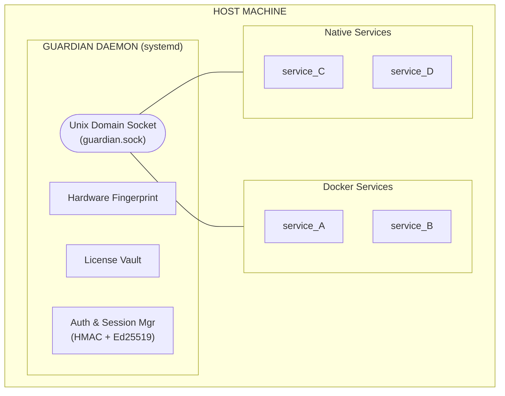
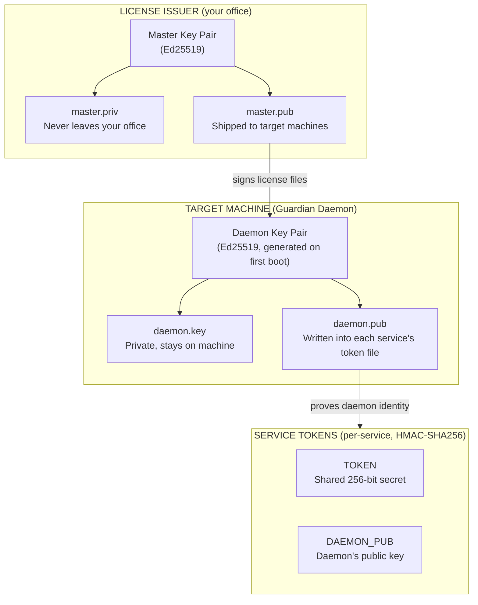
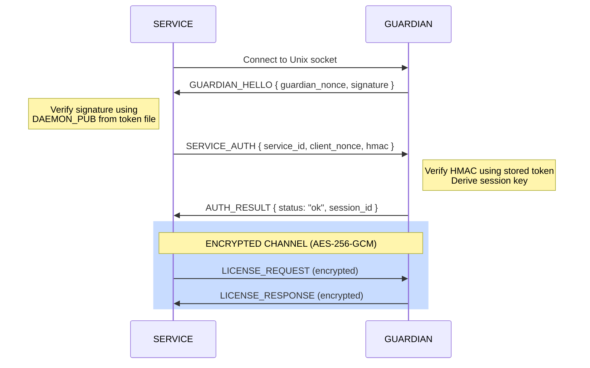

# Guardian — System Architecture

## Overview

Guardian is a Linux daemon that provides hardware-bound license enforcement. It binds a cryptographically signed license to a machine's physical hardware and serves license validation to any local application over a Unix domain socket — whether running natively or inside Docker containers.



---

## Key Hierarchy

Guardian uses a three-tier key hierarchy to establish trust from the license issuer down to individual services:



**Who holds what:**

```
                   LICENSE ISSUER    GUARDIAN DAEMON     SERVICE
                   ──────────────    ──────────────     ────────
Master Private Key    YES               no                no
Master Public Key     YES              YES                no
Daemon Private Key     no              YES                no
Daemon Public Key      no              YES               YES
Service Token          no          ALL (database)     OWN (file)
```

---

## Hardware Fingerprint

Guardian collects five hardware identifiers and computes HMAC-SHA256 hashes of each using a salt embedded in the license file:

| Component | Source |
|-----------|--------|
| Machine ID | `/etc/machine-id` |
| CPU | `/proc/cpuinfo` (model + core count) |
| Motherboard | DMI baseboard serial |
| Disk | Primary disk serial |
| NIC | Primary network interface MAC |

**Threshold matching:** The license stores hashes for all five components. At runtime, Guardian computes live hashes and requires **3 out of 5** to match. This tolerates minor hardware changes (e.g., a NIC replacement) while preventing full machine cloning.

```
License:  [machine_id, cpu, mobo, disk, nic]
Live:     [machine_id, cpu, mobo, disk, nic_NEW]    →  4/5 PASS

Cloned:   [NEW, NEW, NEW, NEW, NEW]                 →  0/5 FAIL
```

---

## License File

A license is a JSON payload signed with Ed25519:

```
GUARDIAN-LICENSE-V1
PAYLOAD:   <base64 encoded JSON>
SIGNATURE: <Ed25519 signature>
SIGNER:    <fingerprint of signing key>
```

The JSON payload contains:

```json
{
  "license_id": "LIC-2026-00451",
  "issued_to": "ACME Corp",
  "expires_at": "2027-02-15T00:00:00Z",
  "hardware": {
    "salt": "...",
    "fingerprints": { "machine_id": "...", "cpu": "...", ... },
    "match_threshold": 3
  },
  "modules": {
    "service_A": {
      "enabled": true,
      "features": ["realtime-alerts", "data-export"],
      "metadata": { "max_users": 50 }
    },
    "service_B": {
      "enabled": true,
      "features": ["thermal-detection"],
      "metadata": { "max_cameras": 20 }
    }
  }
}
```

On startup, Guardian verifies the Ed25519 signature, checks hardware fingerprint against the threshold, and validates expiry before accepting any connections.

---

## Communication Protocol

All communication happens over a Unix domain socket using a length-prefixed binary format:

| Offset | Size | Field |
|--------|------|-------|
| 0 | 4 bytes | `uint32 BE` — total message length |
| 4 | 1 byte | Message type code |
| 5 | N bytes | msgpack payload (encrypted post-handshake) |

**Message types:**

| Code | Name | Direction | Phase |
|------|------|-----------|-------|
| `0x01` | `GUARDIAN_HELLO` | daemon → service | Handshake |
| `0x02` | `SERVICE_AUTH` | service → daemon | Handshake |
| `0x03` | `AUTH_RESULT` | daemon → service | Handshake |
| `0x04` | `LICENSE_REQUEST` | service → daemon | Encrypted |
| `0x05` | `LICENSE_RESPONSE` | daemon → service | Encrypted |
| `0x06` | `HEARTBEAT_PING` | service → daemon | Encrypted |
| `0x07` | `HEARTBEAT_PONG` | daemon → service | Encrypted |
| `0x08` | `REVOKE_NOTICE` | daemon → service | Encrypted |

---

## Handshake

The handshake provides mutual authentication — the service verifies the daemon is legitimate, and the daemon verifies the service holds a valid token. Both sides independently derive the same session key without transmitting it.



**Session key derivation** (computed independently by both sides):

```
session_key = HMAC-SHA256(
    message: guardian_nonce || client_nonce,
    key:     token || "guardian-session-v1"
)
```

The session key is unique per connection (random nonces each time), cannot be computed without the token, and requires no key exchange.

---

## Periodic Health Checks

### Daemon-side watchdog

The daemon continuously monitors two conditions and broadcasts `REVOKE_NOTICE` to all connected services on failure:

- **License expiry** — checked every 1 minute
- **Hardware fingerprint** — re-verified every 5 minutes

### Service-side heartbeats

Services periodically send `HEARTBEAT_PING` and receive `HEARTBEAT_PONG` with current status:

```
HEARTBEAT_PONG {
    hw_status:       "ok" | "mismatch",
    license_status:  "ok" | "expired",
    expires_in_days: 334
}
```

If heartbeats fail or a `REVOKE_NOTICE` is received, the service should enter degraded mode or shut down gracefully.

---

## Deployment Patterns

### Docker services

Mount the socket and per-service token file into each container:

```yaml
services:
  service_A:
    volumes:
      - /var/run/guardian/guardian.sock:/var/run/guardian/guardian.sock:ro
      - /etc/guardian/tokens/service_A.token:/etc/guardian/token:ro

  service_B:
    volumes:
      - /var/run/guardian/guardian.sock:/var/run/guardian/guardian.sock:ro
      - /etc/guardian/tokens/service_B.token:/etc/guardian/token:ro
```

Each container sees its token at the standard path `/etc/guardian/token` regardless of which service it is.

### Native systemd services

Set environment variables pointing to the socket and token:

```ini
[Service]
Environment=GUARDIAN_SOCKET=/var/run/guardian/guardian.sock
Environment=GUARDIAN_TOKEN_PATH=/etc/guardian/tokens/service_A.token
```

---

## Security Properties

| Attack | Protection | Result |
|--------|-----------|--------|
| Clone VM to new hardware | Hardware fingerprint mismatch | Blocked |
| Tamper with license file | Ed25519 signature verification fails | Blocked |
| Fake guardian on socket | Service verifies daemon signature via DAEMON_PUB | Blocked |
| Unauthorized service connects | No valid token, HMAC verification fails | Blocked |
| Replay captured handshake | Random nonces per connection invalidate old HMACs | Blocked |
| Eavesdrop on socket traffic | AES-256-GCM encryption with per-session key | Blocked |
| Non-root reads token files | File permissions `0600 root:root` | Blocked |
| License expires mid-operation | Watchdog detects within 1 minute, sends REVOKE_NOTICE | Detected |
| Hardware swapped mid-operation | Watchdog re-checks every 5 minutes, sends REVOKE_NOTICE | Detected |

---

## Tech Stack

| Component | Technology | Rationale |
|-----------|------------|-----------|
| Language | Go | Static binary, zero runtime dependencies |
| IPC | Unix Domain Socket | No network exposure, kernel-enforced access |
| Signing | Ed25519 | Fast, modern, compact 32-byte keys |
| Authentication | HMAC-SHA256 | Mutual auth without transmitting secrets |
| Encryption | AES-256-GCM | Authenticated encryption, tamper-proof |
| Serialization | msgpack | Compact binary format, language-agnostic |
| Process Manager | systemd | Auto-restart, watchdog, security hardening |
