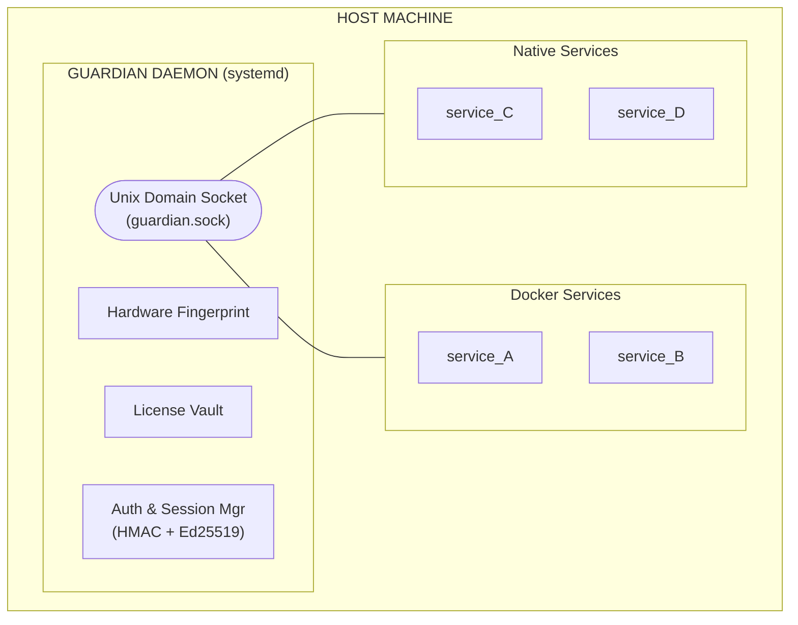

# Guardian

A hardware-bound license enforcement daemon for Linux. Guardian runs as a systemd service and provides license validation to any application — Docker containers or native processes — over a Unix domain socket with mutual authentication and encrypted communication.

## Architecture



### How It Works

1. **License Generation** (your office) — You generate an Ed25519 master key pair and sign a license file bound to the target machine's hardware fingerprint.
2. **Daemon Startup** — `guardiand` verifies the license signature, checks hardware fingerprint (3-of-5 threshold match), and opens a Unix domain socket.
3. **Service Authentication** — Each service connects to the socket and performs a mutual handshake: the daemon proves its identity via Ed25519 signature, and the service proves it holds a valid token via HMAC-SHA256.
4. **Encrypted Channel** — After authentication, all communication is AES-256-GCM encrypted with a per-session key derived from the handshake nonces.
5. **Periodic Checks** — The daemon's watchdog re-verifies hardware and license expiry. Services poll via heartbeats. On failure, a `REVOKE_NOTICE` is broadcast.
6. **Anonymous Status Check** — Any process can connect and send a `STATUS_REQUEST` (without authentication) to check if the daemon is running and the license is healthy. Only non-sensitive operational data is returned (status, expiry days, uptime, version). No session is created.

### Components

| Component | Purpose |
|-----------|---------|
| `guardiand` | Main daemon — listens on Unix socket, validates licenses |
| `guardian-cli` | Admin CLI — register services, check status, rotate tokens |
| `license-gen` | License tool — generate master keys, create/update signed licenses |
| `client/go` | Go client SDK |
| `client/python` | Python client SDK |
| `client/java` | Java client SDK |

### Tech Stack

| What | Technology | Why |
|------|------------|-----|
| Language | Go | Static binary, no runtime deps |
| IPC | Unix Domain Socket | No network exposure |
| Signing | Ed25519 | Fast, modern, 32-byte keys |
| Auth | HMAC-SHA256 | Mutual authentication |
| Encryption | AES-256-GCM | Authenticated encryption |
| Wire Format | msgpack | Compact binary, language-agnostic |

---

## Steps

### 1. Creating a License

#### One-time: generate master key pair

```bash
license-gen init --output-dir=/secure/path/
# Creates: master.priv (KEEP SECRET) and master.pub (ship to machines)
```

#### Collect hardware info from target machine

```bash
# On the target machine (after installing guardian):
guardian-cli export-hardware > hardware-info.json
# Send this file to your office
```

#### Generate the license

```bash
# At your office:
license-gen create \
    --hardware=hardware-info.json \
    --customer="ACME Corp - Production" \
    --expires=2027-02-15 \
    --module service_A:max_users=50,max_sensors=500 \
    --module service_B:max_cameras=20,max_zones=10 \
    --sign-with=/secure/path/master.priv \
    --output=customer-001.license
```

#### Verify a license (optional)

```bash
license-gen verify --license=customer-001.license --pub=/secure/path/master.pub
```

#### Update an existing license

Add new modules, modify existing ones, disable modules, or change the expiration date without creating a license from scratch:

```bash
# Add a new module to an existing license:
license-gen update \
    --license=customer-001.license \
    --sign-with=/secure/path/master.priv \
    --module service_C:max_users=100,region=us-east \
    --output=customer-001-updated.license

# Modify metadata on an existing module (merges with existing keys):
license-gen update \
    --license=customer-001.license \
    --sign-with=/secure/path/master.priv \
    --module service_B:max_cameras=50 \
    --output=customer-001-updated.license

# Disable a module:
license-gen update \
    --license=customer-001.license \
    --sign-with=/secure/path/master.priv \
    --disable service_A \
    --output=customer-001-updated.license

# Change expiration date:
license-gen update \
    --license=customer-001.license \
    --sign-with=/secure/path/master.priv \
    --expires=2028-06-30 \
    --output=customer-001-updated.license
```

You can combine `--module`, `--disable`, and `--expires` in a single command. After updating, deploy the new license file to the target machine and restart the daemon.

---

### 2. First-Time Setup

#### Install binaries

```bash
sudo cp guardiand /usr/local/bin/
sudo cp guardian-cli /usr/local/bin/
sudo cp guardian.service /etc/systemd/system/
```

#### Create directories

```bash
sudo mkdir -p /etc/guardian /var/run/guardian /var/log/guardian
sudo chmod 700 /etc/guardian /var/log/guardian
```

#### Place master public key and license

```bash
sudo cp master.pub /etc/guardian/master.pub
sudo cp customer-001.license /etc/guardian/guardian.license
sudo chmod 600 /etc/guardian/guardian.license
```

#### Copy the example config

```bash
sudo cp configs/guardian.conf.example /etc/guardian/guardian.conf
# Edit as needed (socket path, log path, check intervals)
```

#### Start the daemon

```bash
sudo systemctl enable --now guardian
sudo guardian-cli status    # verify it's running
```

#### Register your services

```bash
# Register each service that needs license validation:
sudo guardian-cli register --service=service_A --modules=service_A
sudo guardian-cli register --service=service_B --modules=service_B

# This creates token files at /etc/guardian/tokens/service_A.token, etc.
```

#### Mount into Docker services (if using Docker)

```yaml
# docker-compose.yml
services:
  service_A:
    image: my-service-a:latest
    volumes:
      - /var/run/guardian/guardian.sock:/var/run/guardian/guardian.sock:ro
      - /etc/guardian/tokens/service_A.token:/etc/guardian/token:ro

  service_B:
    image: my-service-b:latest
    volumes:
      - /var/run/guardian/guardian.sock:/var/run/guardian/guardian.sock:ro
      - /etc/guardian/tokens/service_B.token:/etc/guardian/token:ro
```

For native systemd services, set environment variables instead:

```ini
# /etc/systemd/system/service_A.service
[Service]
Environment=GUARDIAN_SOCKET=/var/run/guardian/guardian.sock
Environment=GUARDIAN_TOKEN_PATH=/etc/guardian/tokens/service_A.token
```

---

### 3. Integrating in a Service

Every service needs to:
1. Connect to Guardian and authenticate
2. Check its module license on startup
3. Periodically re-check via heartbeats
4. Handle valid/invalid callbacks

All three SDKs (Go, Python, Java) follow the same pattern: you provide a **module name**, a **check interval**, a **valid handler** (called when the license is OK), and an **invalid handler** (called when it fails). The SDK handles connection, authentication, periodic checking, and reconnection automatically.

**Anonymous status check:** All SDKs also provide a lightweight `checkStatus` / `check_status` function that requires no token or authentication. It connects, sends a `STATUS_REQUEST`, and returns non-sensitive health data (status, license status, expiry days, daemon version, uptime). Useful for health probes and monitoring.

---

#### Go

**Add to your project:**

```bash
go get github.com/ponder2000/guardian/client/go
```

**Usage:**

```go
package main

import (
    "log"
    "os"
    "os/signal"
    "time"

    guardian "github.com/ponder2000/guardian/client/go"
)

func main() {
    client := guardian.NewClient(
        guardian.WithModule("service_A"),
        guardian.WithCheckInterval(5 * time.Minute),
        guardian.WithValidHandler(func(info *guardian.LicenseInfo) {
            log.Printf("License OK — features: %v, expires in %d days",
                info.Features, info.ExpiresInDays)
        }),
        guardian.WithInvalidHandler(func(info *guardian.LicenseInfo, err error) {
            log.Fatalf("License INVALID: %v", err)
        }),
        // Optional: override socket/token paths (defaults read from env vars)
        // guardian.WithSocket("/var/run/guardian/guardian.sock"),
        // guardian.WithTokenFile("/etc/guardian/token"),
    )

    // Connect, authenticate, check license, start periodic checks.
    if err := client.Start(); err != nil {
        log.Fatal("Guardian start failed:", err)
    }
    defer client.Stop()

    // Force an immediate check anytime:
    info, err := client.ForceCheck()
    if err != nil {
        log.Fatal(err)
    }
    log.Printf("Module: %s, Valid: %v, MaxUsers: %v",
        info.Module, info.Valid, info.Metadata["max_users"])

    // Your application runs here...
    sig := make(chan os.Signal, 1)
    signal.Notify(sig, os.Interrupt)
    <-sig
}
```

**What happens:**
- `Start()` connects to the daemon, authenticates via HMAC handshake, checks the license for `"service_A"`, and begins a background goroutine that re-checks every 5 minutes.
- If the license is valid, `ValidHandler` is called with full details (features, metadata, expiry, hardware status).
- If the license is invalid or the connection drops, `InvalidHandler` is called. The SDK auto-reconnects on the next check cycle.
- `ForceCheck()` performs an immediate check and returns `*LicenseInfo` directly (also triggers callbacks).
- `Stop()` halts the background goroutine and closes the connection.

**Anonymous status check** (no token or auth required):

```go
// Standalone function — just needs the socket path:
status, err := guardian.CheckStatus("/var/run/guardian/guardian.sock")
if err != nil {
    log.Fatal("Guardian not reachable:", err)
}
fmt.Printf("Status: %s, License: %s, Expires in %d days, Version: %s\n",
    status.Status, status.LicenseStatus, status.ExpiresInDays, status.DaemonVersion)

// Or via a Client instance (uses the client's configured socket path):
client := guardian.NewClient(guardian.WithSocket("/var/run/guardian/guardian.sock"))
status, err = client.StatusCheck()
```

---

#### Python

**Install dependencies:**

```bash
pip install msgpack cryptography
```

**Add `guardian_client.py`** from `client/python/` to your project, or copy it into your source tree.

**Usage:**

```python
import sys
import time
from guardian_client import GuardianClient

def on_valid(details):
    """Called when license check succeeds."""
    print(f"License OK for {details.module}")
    print(f"  Features:  {details.features}")
    print(f"  Metadata:  {details.metadata}")
    print(f"  Expires:   {details.expires_in_days} days")

def on_invalid(details, error):
    """Called when license check fails."""
    print(f"LICENSE INVALID: {error}", file=sys.stderr)
    sys.exit(1)

client = GuardianClient(
    module="service_A",
    check_interval=300,              # seconds (5 minutes)
    valid_handler=on_valid,
    invalid_handler=on_invalid,
    # Optional overrides (defaults read from env vars):
    # socket_path="/var/run/guardian/guardian.sock",
    # token_path="/etc/guardian/token",
)

# Connect, authenticate, check license, start periodic checks.
client.start()

# Force an immediate check anytime:
details = client.force_check()
print(f"Valid: {details.valid}, Module: {details.module}")

# Your application runs here...
try:
    while True:
        time.sleep(1)
except KeyboardInterrupt:
    client.stop()
```

**Anonymous status check** (no token or auth required):

```python
from guardian_client import check_status

status = check_status("/var/run/guardian/guardian.sock")
print(f"Status: {status.status}, License: {status.license_status}")
print(f"Expires in {status.expires_in_days} days, Version: {status.daemon_version}")

# Or via a client instance:
client = GuardianClient(module="unused")
status = client.status_check()
```

**Environment variables** (alternative to constructor args):
```bash
export GUARDIAN_SOCKET="/var/run/guardian/guardian.sock"
export GUARDIAN_TOKEN_PATH="/etc/guardian/tokens/service_A.token"
python3 my_service.py
```

---

#### Java

**Add dependency** (Maven):

```xml
<dependency>
    <groupId>org.msgpack</groupId>
    <artifactId>msgpack-core</artifactId>
    <version>0.9.8</version>
</dependency>
```

**Add `GuardianClient.java`** from `client/java/src/main/java/com/guardian/` to your project.

Requires **Java 16+** (for `UnixDomainSocketAddress`).

**Usage:**

```java
import com.guardian.GuardianClient;
import com.guardian.GuardianClient.LicenseDetails;
import java.time.Duration;

public class MyService {
    public static void main(String[] args) throws Exception {
        GuardianClient guardian = new GuardianClient.Builder()
            .module("service_A")
            .checkInterval(Duration.ofMinutes(5))
            .onValid(details -> {
                System.out.println("License OK — features: " + details.getFeatures());
                System.out.println("  Expires in " + details.getExpiresInDays() + " days");
            })
            .onInvalid((details, error) -> {
                System.err.println("LICENSE INVALID: " + error.getMessage());
                System.exit(1);
            })
            // Optional overrides:
            // .socketPath("/var/run/guardian/guardian.sock")
            // .tokenPath("/etc/guardian/token")
            .build();

        // Connect, authenticate, check license, start periodic checks.
        guardian.start();

        // Force an immediate check anytime:
        LicenseDetails details = guardian.forceCheck();
        System.out.println("Valid: " + details.isValid());
        System.out.println("Max users: " + details.getMetadata().get("max_users"));

        // Your application runs here...
        Runtime.getRuntime().addShutdownHook(new Thread(guardian::stop));
        Thread.currentThread().join();
    }
}
```

**Anonymous status check** (no token or auth required):

```java
import com.guardian.GuardianClient;
import com.guardian.GuardianClient.StatusInfo;

// Standalone — just needs the socket path:
StatusInfo status = GuardianClient.checkStatus("/var/run/guardian/guardian.sock");
System.out.println("Status: " + status.getStatus());
System.out.println("License: " + status.getLicenseStatus());
System.out.println("Expires in " + status.getExpiresInDays() + " days");
System.out.println("Version: " + status.getDaemonVersion());

// Or via a client instance:
GuardianClient client = new GuardianClient.Builder().module("unused").build();
StatusInfo info = client.statusCheck();
```

**Environment variables** (alternative to builder):
```bash
export GUARDIAN_SOCKET="/var/run/guardian/guardian.sock"
export GUARDIAN_TOKEN_PATH="/etc/guardian/tokens/service_A.token"
java -jar my-service.jar
```

---

### 4. Troubleshooting

#### Cannot connect to Guardian socket

```
Error: guardian: connect to /var/run/guardian/guardian.sock: no such file or directory
```

**Fix:** Ensure the Guardian daemon is running:
```bash
sudo systemctl status guardian
sudo journalctl -u guardian -f    # check logs
```

If the socket file doesn't exist, the daemon hasn't started. Check logs for license or hardware errors.

#### Authentication failed

```
Error: guardian: authentication failed: authentication failed
```

**Fix:** The token file may be stale or corrupted.
```bash
# Regenerate the token:
sudo guardian-cli rotate --service=service_A

# If using Docker, restart the container to pick up the new token.
docker-compose restart service_A
```

#### License invalid for module

```
Error: guardian: license invalid for module service_A
```

**Fix:** The module is either disabled in the license or doesn't exist:
```bash
sudo guardian-cli license-info    # check which modules are enabled
```

If the module should be enabled, update the license:
```bash
license-gen update --license=customer.license --sign-with=master.priv \
    --module service_A:max_users=50 --output=customer-updated.license
```

#### Hardware mismatch

```
Guardian Status:
  Hardware: MISMATCH (2/5 components, threshold: 3)
```

**Fix:** Significant hardware changes require a new license. Export the new hardware info and request a re-issued license:
```bash
sudo guardian-cli export-hardware > new-hardware.json
# Send to license issuer, get a new .license file, then:
sudo guardian-cli import-license new-customer.license
sudo systemctl restart guardian
```

#### License expired

```
Error: license expired
```

**Fix:** Extend the license expiration:
```bash
license-gen update --license=customer.license --sign-with=master.priv \
    --expires=2028-12-31 --output=customer-renewed.license
```
Deploy the renewed license and restart the daemon.

#### Socket permission denied (Docker)

```
Error: permission denied: /var/run/guardian/guardian.sock
```

**Fix:** Ensure the socket is mounted as a volume in `docker-compose.yml`:
```yaml
volumes:
  - /var/run/guardian/guardian.sock:/var/run/guardian/guardian.sock:ro
```

The socket has `0666` permissions by default, so any process can connect. If you see permission errors, check that the volume mount path is correct.

#### Periodic check shows "reconnect failed"

This means the daemon went down or the connection was lost. The SDK will auto-reconnect on the next check cycle. Ensure the daemon is running:
```bash
sudo systemctl restart guardian
```

---

## Project Structure

```
guardian/
├── cmd/
│   ├── guardiand/           # Main daemon binary
│   ├── guardian-cli/        # Admin CLI tool
│   └── license-gen/         # License generation tool
├── internal/
│   ├── auth/                # Token store, handshake, sessions
│   ├── config/              # Configuration file parser
│   ├── crypto/              # Ed25519, AES-256-GCM, HMAC-SHA256
│   ├── fingerprint/         # Hardware fingerprint collection
│   ├── license/             # License parsing and verification
│   ├── protocol/            # Binary wire format (msgpack)
│   ├── server/              # Unix socket server
│   └── watchdog/            # Periodic health checks
├── client/
│   ├── go/                  # Go client SDK
│   ├── python/              # Python client SDK
│   └── java/                # Java client SDK
├── configs/
│   ├── guardian.conf.example
│   └── guardian.service     # systemd unit file
├── Makefile
├── go.mod
└── README.md
```

## Building

### From source

```bash
make build              # build for current OS/arch → bin/<os>/
make build-linux        # cross-compile for linux/amd64
make build-macos        # cross-compile for darwin/arm64
```

Or directly with `go build`:

```bash
go build -o guardiand ./cmd/guardiand
go build -o guardian-cli ./cmd/guardian-cli
go build -o license-gen ./cmd/license-gen
```

### Debian package

Build a `.deb` that installs binaries, systemd unit, and default config:

```bash
make package-deb                 # requires dpkg-deb
# Output: bin/guardian_0.1.0_amd64.deb
```

Custom version:

```bash
make package-deb VERSION=1.2.0   # → bin/guardian_1.2.0_amd64.deb
```

The package includes:
- `/usr/local/bin/guardiand`, `guardian-cli`, `license-gen`
- `/etc/guardian/guardian.conf` (marked as conffile — preserved on upgrade)
- `/lib/systemd/system/guardian.service`
- `/var/run/guardian/` and `/var/log/guardian/` directories
- postinst script that enables the systemd service
- prerm script that stops the service before removal

### Install the .deb

```bash
sudo dpkg -i bin/guardian_0.1.0_amd64.deb

# The service is enabled but not started yet.
# Place your license and master.pub first, then:
sudo systemctl start guardian
```

### Uninstall

```bash
sudo dpkg -r guardian
```

## Testing

```bash
make test               # go test ./... -v
make test-race          # go test -race ./...
```

## Clean

```bash
make clean              # remove all build artifacts
```

## License

Proprietary. All rights reserved.
