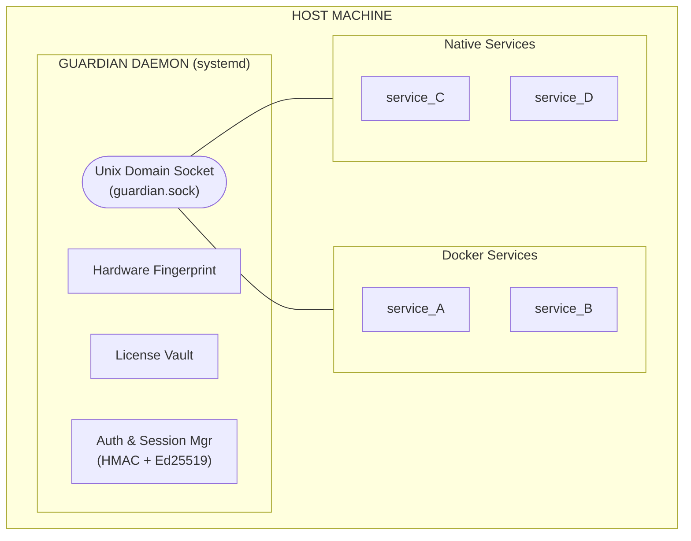
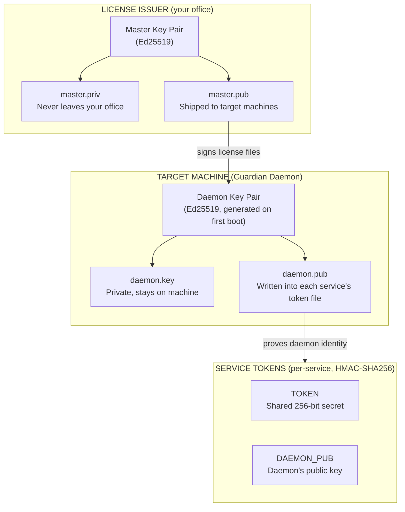
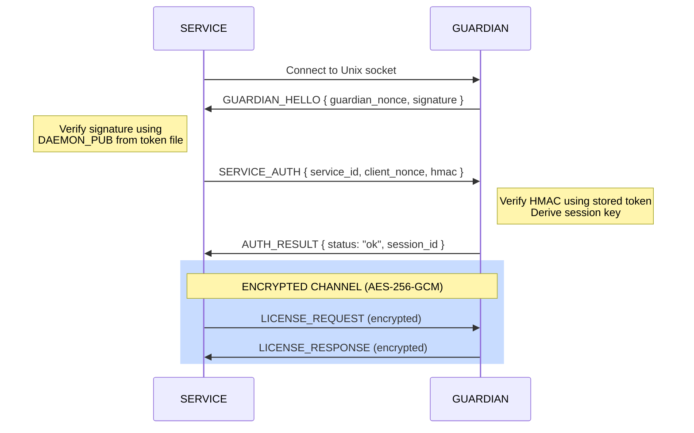
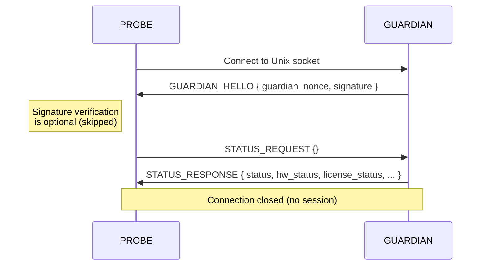

# Guardian Architecture

## Overview

Guardian is a Linux daemon that provides hardware-bound license enforcement. It binds a cryptographically signed license to a machine's physical hardware and serves license validation to any local application over a Unix domain socket — whether running natively or inside Docker containers.



## How It Works

1. **License Generation** (your office) — Generate an Ed25519 master key pair and sign a license file bound to the target machine's hardware fingerprint.
2. **Daemon Startup** — `guardiand` verifies the license signature, checks hardware fingerprint (3-of-5 threshold match), and opens a Unix domain socket.
3. **Service Authentication** — Each service connects and performs a mutual handshake: the daemon proves identity via Ed25519 signature, and the service proves it holds a valid token via HMAC-SHA256.
4. **Encrypted Channel** — After authentication, all communication is AES-256-GCM encrypted with a per-session key derived from the handshake nonces.
5. **Periodic Checks** — The watchdog re-verifies hardware and license expiry. Services poll via heartbeats. On failure, `REVOKE_NOTICE` is broadcast.
6. **Anonymous Status Check** — Any process can check daemon health without authentication. Only non-sensitive operational data is returned.

---

## Key Hierarchy

Guardian uses a three-tier key hierarchy to establish trust from the license issuer down to individual services:



**Who holds what:**

```
                   LICENSE ISSUER    GUARDIAN DAEMON     SERVICE
                   ──────────────    ──────────────     ────────
Master Private Key    YES               no                no
Master Public Key     YES              YES                no
Daemon Private Key     no              YES                no
Daemon Public Key      no              YES               YES
Service Token          no          ALL (database)     OWN (file)
```

---

## Hardware Fingerprint

Guardian collects five hardware identifiers and computes HMAC-SHA256 hashes of each using a random salt embedded in the license file:

| Component | Source |
|-----------|--------|
| Machine ID | `/etc/machine-id` |
| CPU | `/proc/cpuinfo` (model + core count) |
| Motherboard | DMI baseboard serial |
| Disk | Primary disk serial |
| NIC | Primary network interface MAC |

**Threshold matching:** The license stores hashes for all five components. At runtime, Guardian computes live hashes and requires **3 out of 5** to match (configurable 1-5). This tolerates minor hardware changes while preventing machine cloning.

```
License:  [machine_id, cpu, mobo, disk, nic]
Live:     [machine_id, cpu, mobo, disk, nic_NEW]    →  4/5 PASS

Cloned:   [NEW, NEW, NEW, NEW, NEW]                 →  0/5 FAIL
```

---

## License File Format

A license is a JSON payload signed with Ed25519:

```
GUARDIAN-LICENSE-V1
PAYLOAD:   <base64 encoded JSON>
SIGNATURE: <Ed25519 signature>
SIGNER:    <SHA256 fingerprint of signing key>
```

The JSON payload contains:

```json
{
  "license_id": "LIC-2026-00451",
  "version": 1,
  "issued_to": "ACME Corp",
  "issued_at": "2026-02-15T12:00:00Z",
  "expires_at": "2027-02-15T00:00:00Z",
  "hardware": {
    "salt": "hex-encoded-random-salt",
    "fingerprints": {
      "machine_id": "hmac-sha256-hex",
      "cpu": "hmac-sha256-hex",
      "motherboard": "hmac-sha256-hex",
      "disk": "hmac-sha256-hex",
      "nic": "hmac-sha256-hex"
    },
    "match_threshold": 3
  },
  "modules": {
    "service_A": {
      "enabled": true,
      "features": ["realtime-alerts", "data-export"],
      "metadata": { "max_users": 50, "max_sensors": 500 }
    },
    "service_B": {
      "enabled": true,
      "features": ["thermal-detection"],
      "metadata": { "max_cameras": 20 }
    }
  },
  "global_limits": {}
}
```

---

## Wire Protocol

All communication happens over a Unix domain socket using a length-prefixed binary format:

| Offset | Size | Field |
|--------|------|-------|
| 0 | 4 bytes | `uint32 BE` — total message length |
| 4 | 1 byte | Message type code |
| 5 | N bytes | msgpack payload (encrypted post-handshake) |

Where `length = 1 + len(payload)`.

### Message Types

| Code | Name | Direction | Phase |
|------|------|-----------|-------|
| `0x01` | `GUARDIAN_HELLO` | daemon -> service | Handshake |
| `0x02` | `SERVICE_AUTH` | service -> daemon | Handshake |
| `0x03` | `AUTH_RESULT` | daemon -> service | Handshake |
| `0x04` | `LICENSE_REQUEST` | service -> daemon | Encrypted |
| `0x05` | `LICENSE_RESPONSE` | daemon -> service | Encrypted |
| `0x06` | `HEARTBEAT_PING` | service -> daemon | Encrypted |
| `0x07` | `HEARTBEAT_PONG` | daemon -> service | Encrypted |
| `0x08` | `REVOKE_NOTICE` | daemon -> service | Encrypted |
| `0x09` | `STATUS_REQUEST` | service -> daemon | Unauthenticated |
| `0x0A` | `STATUS_RESPONSE` | daemon -> service | Unauthenticated |

---

## Handshake Flow

The handshake provides mutual authentication — the service verifies the daemon is legitimate, and the daemon verifies the service holds a valid token. Both sides independently derive the same session key without transmitting it.



**Session key derivation** (computed independently by both sides):

```
session_key = HMAC-SHA256(
    message: guardian_nonce || client_nonce,
    key:     token || "guardian-session-v1"
)
```

The session key is unique per connection (random nonces each time), cannot be computed without the token, and requires no key exchange over the wire.

---

## Anonymous Status Check

Any process can send a `STATUS_REQUEST` without authentication to get a quick health probe. No token, service ID, or module name is required. No session is created.



**`STATUS_RESPONSE` payload:**

```json
{
  "status": "ok",
  "hw_status": "ok",
  "license_status": "ok",
  "expires_in_days": 334,
  "daemon_version": "1.2.0",
  "uptime": 86400
}
```

**Not exposed:** module names, feature lists, license IDs, customer information, hardware fingerprint values, or any metadata.

---

## Periodic Health Checks

### Daemon-side Watchdog

The daemon continuously monitors two conditions and broadcasts `REVOKE_NOTICE` to all connected services on failure:

| Check | Default Interval | Configurable |
|-------|-----------------|--------------|
| License expiry | 1 minute | `license_check_interval` |
| Hardware fingerprint | 5 minutes | `hardware_check_interval` |

### Service-side Heartbeats

Services periodically send `HEARTBEAT_PING` and receive `HEARTBEAT_PONG` with current status:

```json
{
  "hw_status": "ok",
  "license_status": "ok",
  "expires_in_days": 334
}
```

If heartbeats fail or a `REVOKE_NOTICE` is received, the service should enter degraded mode or shut down.

---

## Configuration

Guardian uses an INI-style configuration file (default: `/etc/guardian/guardian.conf`):

```ini
[daemon]
socket_path = /var/run/guardian/guardian.sock
log_path = /var/log/guardian/guardian.log
log_level = info
pid_file = /var/run/guardian/guardian.pid

[license]
license_file = /etc/guardian/guardian.license
master_pub = /etc/guardian/master.pub

[crypto]
daemon_key = /etc/guardian/daemon.key
daemon_pub = /etc/guardian/daemon.pub
token_db = /etc/guardian/tokens.db

[watchdog]
hardware_check_interval = 5m
license_check_interval = 1m
session_timeout = 30m

[security]
max_connections = 50
max_auth_attempts = 3
auth_timeout = 10s
nonce_size = 32
```

### Configuration Sections

**`[daemon]`** — Core daemon settings

| Key | Default | Description |
|-----|---------|-------------|
| `socket_path` | `/var/run/guardian/guardian.sock` | Unix domain socket path |
| `log_path` | `/var/log/guardian/guardian.log` | Log file path |
| `log_level` | `info` | Log level (`debug`, `info`, `warn`, `error`) |
| `pid_file` | `/var/run/guardian/guardian.pid` | PID file path |

**`[license]`** — License and key paths

| Key | Description |
|-----|-------------|
| `license_file` | Path to the signed `.license` file |
| `master_pub` | Path to the master Ed25519 public key |

**`[crypto]`** — Daemon keys and token storage

| Key | Description |
|-----|-------------|
| `daemon_key` | Daemon Ed25519 private key (auto-generated on first run) |
| `daemon_pub` | Daemon Ed25519 public key (auto-generated on first run) |
| `token_db` | Path to the token database file |

**`[watchdog]`** — Health check intervals

| Key | Default | Description |
|-----|---------|-------------|
| `hardware_check_interval` | `5m` | How often to re-verify hardware fingerprint |
| `license_check_interval` | `1m` | How often to check license expiry |
| `session_timeout` | `30m` | Idle session timeout |

**`[security]`** — Connection and auth limits

| Key | Default | Description |
|-----|---------|-------------|
| `max_connections` | `50` | Maximum concurrent connections |
| `max_auth_attempts` | `3` | Max failed auth attempts before blocking |
| `auth_timeout` | `10s` | Timeout for completing the handshake |
| `nonce_size` | `32` | Size of random nonces in bytes |

---

## Deployment Patterns

### Docker Services

Mount the socket and per-service token file into each container:

```yaml
services:
  service_A:
    volumes:
      - /var/run/guardian/guardian.sock:/var/run/guardian/guardian.sock:ro
      - /etc/guardian/tokens/service_A.token:/etc/guardian/token:ro

  service_B:
    volumes:
      - /var/run/guardian/guardian.sock:/var/run/guardian/guardian.sock:ro
      - /etc/guardian/tokens/service_B.token:/etc/guardian/token:ro
```

Each container sees its token at the standard path `/etc/guardian/token`.

### Native systemd Services

Set environment variables in the service unit:

```ini
[Service]
Environment=GUARDIAN_SOCKET=/var/run/guardian/guardian.sock
Environment=GUARDIAN_TOKEN_PATH=/etc/guardian/tokens/service_A.token
```

---

## Systemd Integration

Guardian supports `Type=notify` with systemd:

- Sends `READY=1` after successful startup (license verified, socket listening)
- Responds to `WatchdogSec` keepalive checks
- Supports `SIGHUP` for license reload without restart (`ExecReload=/bin/kill -HUP $MAINPID`)
- Security hardening: `ProtectSystem=strict`, `PrivateTmp=true`, `NoNewPrivileges=true`

---

## Security Properties

| Attack | Protection | Result |
|--------|-----------|--------|
| Clone VM to new hardware | Hardware fingerprint mismatch | Blocked |
| Tamper with license file | Ed25519 signature verification fails | Blocked |
| Fake guardian on socket | Service verifies daemon signature via DAEMON_PUB | Blocked |
| Unauthorized service connects | No valid token, HMAC verification fails | Blocked |
| Replay captured handshake | Random nonces per connection invalidate old HMACs | Blocked |
| Eavesdrop on socket traffic | AES-256-GCM encryption with per-session key | Blocked |
| Non-root reads token files | File permissions `0600 root:root` | Blocked |
| License expires mid-operation | Watchdog detects within 1 minute, sends REVOKE_NOTICE | Detected |
| Hardware swapped mid-operation | Watchdog re-checks every 5 minutes, sends REVOKE_NOTICE | Detected |
| Probe anonymous endpoint for secrets | STATUS_RESPONSE contains only health data | Safe |

---

## Tech Stack

| Component | Technology | Rationale |
|-----------|------------|-----------|
| Language | Go | Static binary, zero runtime dependencies |
| IPC | Unix Domain Socket | No network exposure, kernel-enforced access |
| Signing | Ed25519 | Fast, modern, compact 32-byte keys |
| Authentication | HMAC-SHA256 | Mutual auth without transmitting secrets |
| Encryption | AES-256-GCM | Authenticated encryption, tamper-proof |
| Serialization | msgpack | Compact binary format, language-agnostic |
| Process Manager | systemd | Auto-restart, watchdog, security hardening |

---

## Project Structure

```
guardian/
├── cmd/
│   ├── guardiand/           # Main daemon binary
│   ├── guardian-cli/        # Admin CLI tool
│   ├── license-gen/         # License generation tool
│   └── guardian-manager/    # Web admin panel
├── internal/
│   ├── auth/                # Token store, handshake, sessions
│   ├── config/              # INI-style configuration parser
│   ├── crypto/              # Ed25519, AES-256-GCM, HMAC-SHA256
│   ├── fingerprint/         # Hardware fingerprint collection
│   ├── license/             # License parsing and verification
│   ├── protocol/            # Binary wire format (msgpack)
│   ├── server/              # Unix socket server, connection handling
│   ├── store/               # SQLite store (manager)
│   └── watchdog/            # Periodic health checks
├── client/
│   ├── go/                  # Go client SDK
│   ├── python/              # Python client SDK
│   └── java/                # Java client SDK
├── configs/
│   ├── guardian.conf.example
│   └── guardian.service
├── docs/                    # Documentation
├── Makefile
├── go.mod
└── README.md
```
